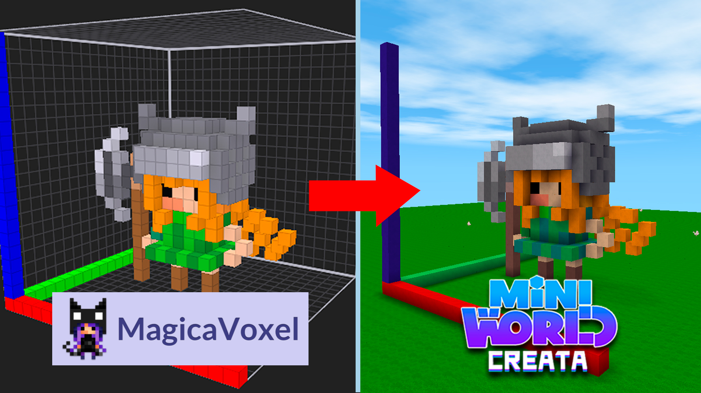
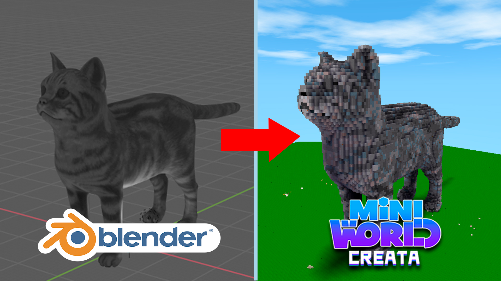
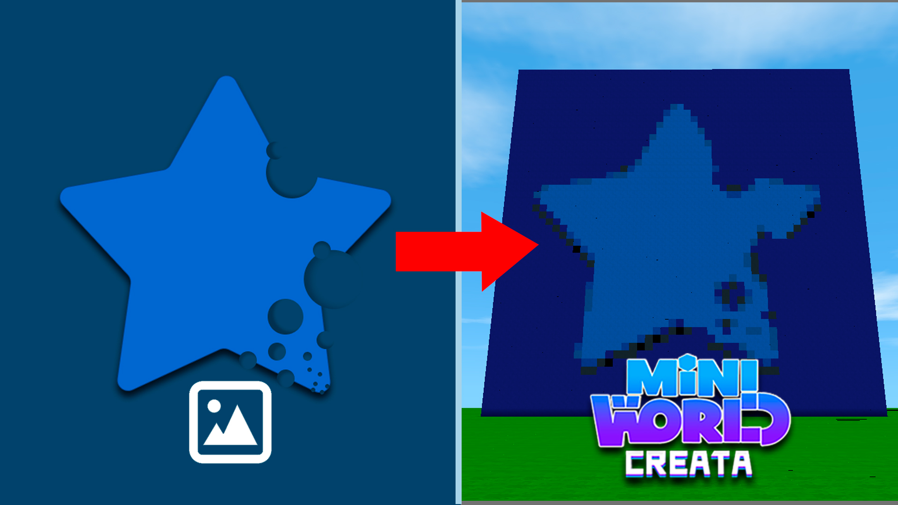
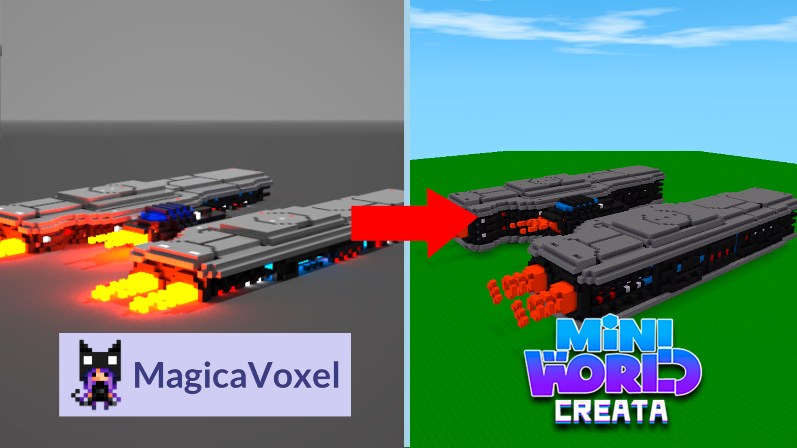

## Description
This program was created with the intention of facilitating mini game developers in the Mini World Creata game, making it possible to use an external tool such as MagicaVoxel to create voxel models with more efficiency and quality, the purpose of the app is to generate a script for the automatic construction in the game from voxel models.

## How to use

>Watch video tutorials to learn how to use the app
>
>[How to use the Mini World Auto Builder app - Tutorial 1](https://www.youtube.com/watch?v=cMcZrRz0lRA&list=PLLcS6ldQh_lwxzNRjsAgwjVg_CcOJsxFd&index=1)
>
>

>[How to convert 3D models into Mini World construction - Tutorial 2](https://www.youtube.com/watch?v=KMDyrIF_KgQ&list=PLLcS6ldQh_lwxzNRjsAgwjVg_CcOJsxFd&index=3)
>
>

>[How to convert images in Mini World construction - Tutorial 3](https://www.youtube.com/watch?v=nCnu_x0BKlc&list=PLLcS6ldQh_lwxzNRjsAgwjVg_CcOJsxFd&index=4)
>
>

>[How to download and convert models into Mini World buildings - Tutorial 4](https://www.youtube.com/watch?v=C5_AskKkqEE&list=PLLcS6ldQh_lwxzNRjsAgwjVg_CcOJsxFd&index=5)
>
>

---

###  Contacts
> If you have any doubts or suggestions, please contact us.
> - Email-contato.playcraft@gmail.com
> - [Server on discord](https://discord.gg/E4bS997d76)

---

### Credits

> - 3D model [zixisun02](https://sketchfab.com/zixisun51)
