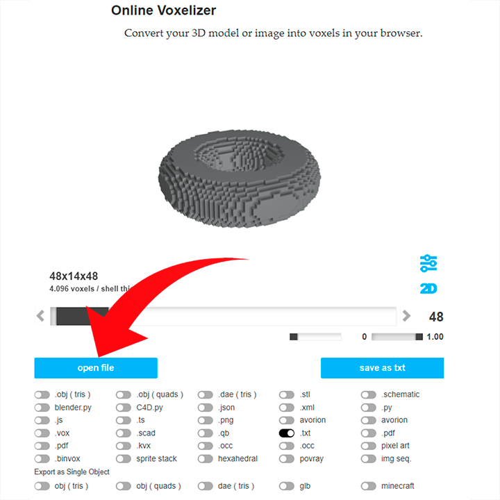
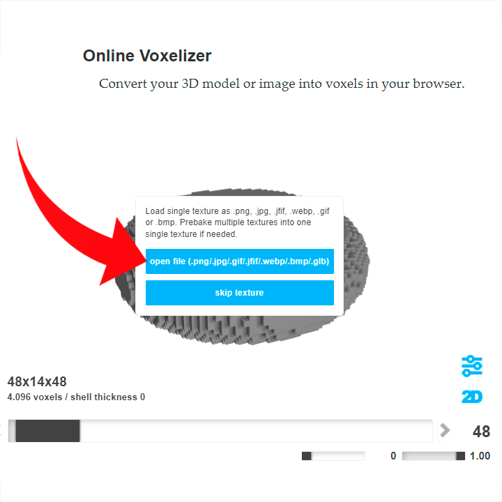
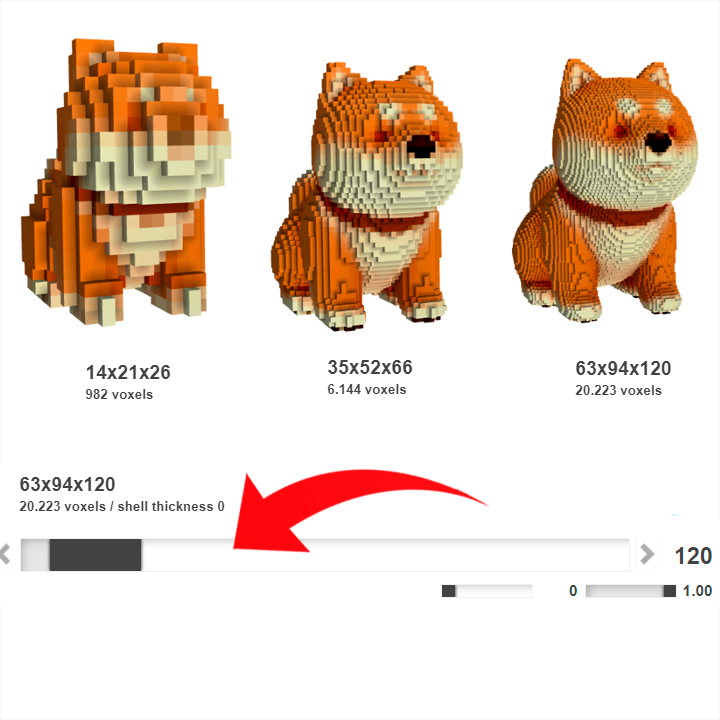
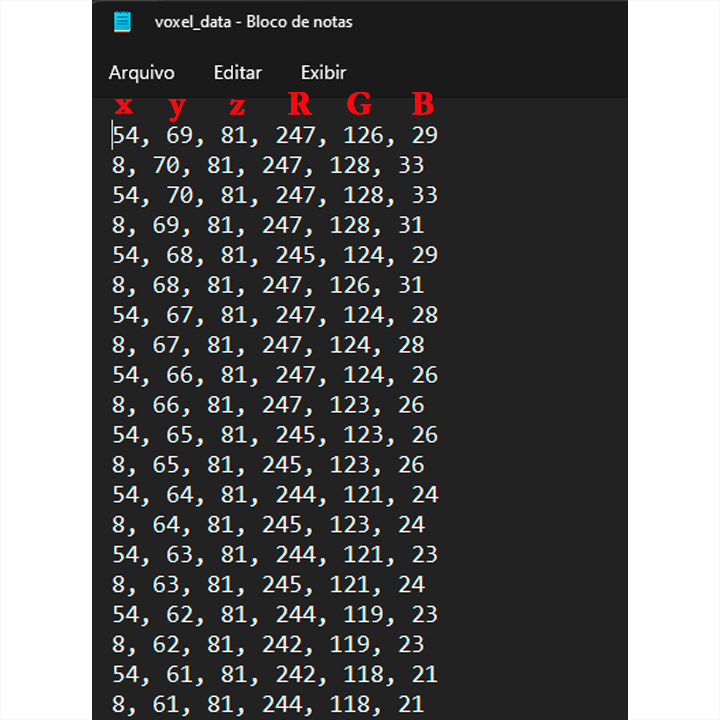

# Mini-World-Auto-Builder
Transformar modelos  3d/voxel ou imagem em construções no jogo  Mini World

## Como usar

### 1 Passo

Escolher modelo ou imagem desejado. 

### 2 Passo

Converter o seu modelo para formato texto que será manipulado pelo script. 

Use o site.

[Voxelizer online](https://drububu.com/miscellaneous/voxelizer)

### 3 Passo

Localiza no seu dispositivo o seu modelo selecione e a abra ele.

Caso o seu modelo tenha textura ela deve ser como uma única imagem que é o formato aceito pelo site.

Se o formato do teu arquivo não for compatível com o site, deve converte-los usado outros sites
ou programas de modelação 3d como o Blender de forma que tenha o modelo em (.obj) e a textura em 
(.png/.jpg). Como por exemplo a transformação de um modelo com extensão FBX para OBJ.

***Qualidade vs Tamanho***

Você pode escolher a qualidade da sua construção baseada na ***quantidade de voxels*** quando mais voxels 
melhor será a qualidade e também maior o tamanho da construção no mapa, deve ficar atendo para não 
ultrapassar de ***28 mil voxels*** esse foi limite máximo que meu jogo aceitou caso contrário ao tentar 
salvar o script o jogo fecha sozinho. 

***Como altear a qualidade***

Você pode regular o número de voxel arrastando essa barra

***Tamanho da construção***

Usando o model com 20 mil voxel as dimensões dele serão de 63 blocos no eixo x ,94 no eixo y e 
120 no eixo z.Deve ter e conta que a coordenada y corresponde à altura no mapa logo não deve 
ter o modelo maior que a altura máxima do jogo. 

### 4 Passo

***Exportação***

Após terminar todos os as configurações você poderá exportar, você pode exportar como vox para 
continuar fazendo mais alterações usando o MagicaVoxel que será mencionado mais tarde.Quando o 
modelo está ***pronto para ser construído deve salvar ele como texto** que é o formato aceitado pelo script.

Após isso o ficheiro será baixado automaticamente.

***Copiar conteudo***

Abra o aquivo baixado e copie todo

O Arquivo contém as coordenadas e a cor em RGB de cada voxel.

Cole ou substitua o conteúdo no ficheiro com nome [voxel_data](voxel_data.txt)

### 6 Passo

***Execute o script***

Execute o script [main](main.py)

Dependendo da quantidade de dados os scripts pode demorar alguns segundos 
para finalizar a execução.

***Copiar script gerado***

Entre no ficheiro com nome [lua_script](lua_script.txt) copie tudo.

Crie um novo script no Mini World e cole tudo

