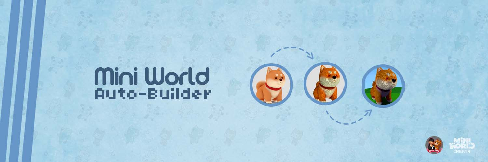

## Como usar

>### 1-Importação
>
>Escolher modelo ou imagem desejado,converter o seu modelo para formato texto 
>que será manipulado pelo script. 
>
>Use o site.
>
>[Voxelizer online](https://drububu.com/miscellaneous/voxelizer)
>
>Se o formato do teu arquivo não for compatível com o site, deve converte-los usado outros sites
>ou programas de modelação 3d como o Blender de forma que tenha o modelo em (.obj) e a textura em 
>(.png/.jpg). Como por exemplo a transformação de um modelo com extensão FBX para OBJ.
>
>Localiza no seu dispositivo o seu modelo selecione e a abra ele.
>
>
>
>Caso o seu modelo tenha textura ela deve ser como uma única imagem que é o formato aceito pelo site.
>
>
>
>***Qualidade vs Tamanho***
>
>Você pode escolher a qualidade da sua construção baseada na ***quantidade de voxels*** quando mais voxels 
>melhor será a qualidade e também maior o tamanho da construção no mapa, deve ficar atendo para não 
>ultrapassar de ***28 mil voxels*** esse foi limite máximo que meu jogo aceitou caso contrário ao tentar 
>salvar o script o jogo fecha sozinho. 
>
>***Como altear a qualidade***
>
>Você pode regular o número de voxel arrastando essa barra
>
>
>
>***Tamanho da construção***
>
>Usando o model com 20 mil voxel as dimensões dele serão de 63 blocos no eixo x ,94 no eixo y e 
>120 no eixo z.Deve ter e conta que a coordenada y corresponde à altura no mapa logo não deve 
>ter o modelo maior que a altura máxima do jogo. 

---

>### 2-Exportação
>
>Após terminar todos os as configurações você poderá exportar, você pode exportar como vox para 
>continuar fazendo mais alterações usando o MagicaVoxel que será mencionado mais tarde.Quando o 
>modelo está pronto para ser construído deve salvar ele como `texto` que é o formato aceitado pelo script.
>
>
>
>Após isso o ficheiro será baixado automaticamente.
>
>O Arquivo contém as coordenadas e a cor em RGB de cada voxel.
>
>Cole ou substitua o conteúdo no ficheiro com nome [voxel_data](voxel_data.txt)
>
>
>

---

>### 3-Execute o script
>
>Dependendo da quantidade de dados os scripts pode demorar alguns segundos 
>para finalizar a execução,requer o interpretador do python instalado.
>
>Use a sua IDE ou seguia os passos para executar pelo terminal.
><ul>
>  <li>Entre na pasta baixada</li>
>  <li>Clique no endereço </li>
>  <li>Digite cmd</li>
>  </ul>
>  
>Automaticamente abrirá o endereço no terminal, para executar digite o seguinte comando 
>
>`````
>python main.py
>`````
>
>

---

>### 4-Copiar codigo gerado
>Após terminal e execução do código entre no ficheiro com nome [lua_script](lua_script.txt) copie tudo.
>
>Crie um novo script no Mini World e cole tudo
>
>
>Para sua construção manter no mapa ao mudar para modo criativo você deve desativar o reset 
>do mapa nas configurações do objetivo do jogo.
>
>

---

>### 5-Construir
>Escolhe um local e clique, a sua construção será construída no mapa com base nessa localização, 
>a construção sempre será construído para Norte e Este do local onde clicou.  
>
>

### MagicaVoxel


